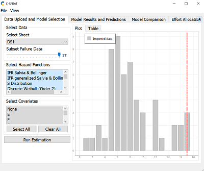
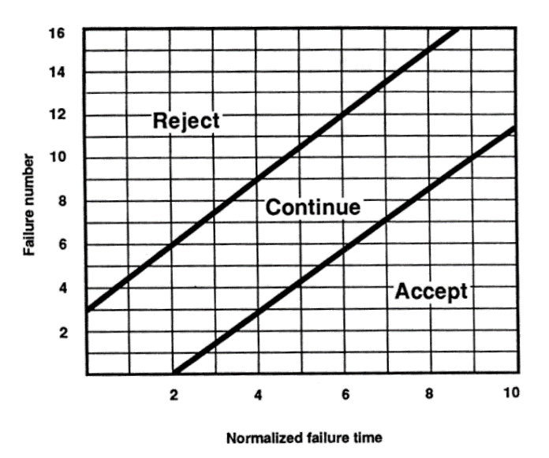

**SENG 637 - Dependability and Reliability of Software Systems**

> **Assignment #5**

> **Software Reliability Assessment**

> Instructor: Dr. Behrouz Far (far@ucalgary.ca) 
> Department of Electrical and Software Engineering 
> University of Calgary 
> **Summary:**
> - Install a reliability assessment (reliability growth and reliability demonstration chart) tool.
> - Run the tool and feed the provided data into it.
> - Display and discuss the results.

> **Due Date:** Check D2L for the submission deadline.

# 1 INTRODUCTION

This lab includes analysis of integration test data using reliability assessment tools. There are two ways to assess failure data:

1. Reliability growth testing
2. Reliability assessment using Reliability Demonstration Chart (RDC)

Both will be practiced in this lab.

# 2 PART 1: RELIABILITY GROWTH TESTING

## 2.1 OBJECTIVES

The purpose of this assignment is to give students hands-on experience on assessing the reliability of a hypothetical system given its failure data collected during integration testing. To do this, students will need to install a reliability growth assessment tool, such as `C-SFRAT`, and create plots of failure rate and reliability of SUT.

After completing this part, students will:

- gain an understanding of what reliability growth testing is and why it is useful.
- be able to measure the failure rate, MTTF and reliability of the SUT through analyzing the test data.
- become familiar with the features and usage of a reliability growth testing tool.

## 2.2 TESTING TOOLS

The testing tool to be used in this part, is `C-SFRAT` (an open source software developed by Python).

## 2.3 SYSTEM UNDER TEST

The system to be tested for this part is a hypothetical system and its failure data is attached ([failure-data-a5.zip](failure-data-a5.zip)).

**Note**: Read readme.txt in `failure-data-a5.zip` to learn about the dataset format

## 2.4 FAMILIARIZATION

## 2.4.1 INSTALL `C-SFRAT`

1. Get `C-SFRAT` binary from [GitHub](https://github.com/LanceFiondella/C-SFRAT/releases/tag/v1.0). There are a Windows and a Linux executable. Download and unzip the appropriate version on your system.
2. Run and verify its functionalities.

## 2.5  **INSTRUCTIONS**

### 2.5.1 Running `C-SFRAT`

The Covariate Software Failure and Reliability Assessment Tool (`C-SFRAT`) is an open source application that applies covariate software reliability models to help guide model selection and test activity allocation.

1. Install the tool.
2. Load the provided data into the tool.
3. Use the tool's features to analyze the data and generate relevant reliability metrics and graphs.
4. Interpret the results and discuss the reliability of the system based on the generated metrics and graphs.

For more information about the input format and features of the tool, you can read [A covariate software tool to guide test activity allocation](https://www.sciencedirect.com/science/article/pii/S2352711021001588)

**Note:** If the tools mentioned above do not work for you, please look for alternative tools that may be suitable.

1. Software Defect Estimation Tool (SweET): [https://github.com/LanceFiondella/SwEET](https://github.com/LanceFiondella/SwEET)

2. Software Failure and Reliability Assessment Tool (SFRAT): [https://github.com/LanceFiondella/srt.core](https://github.com/LanceFiondella/srt.core)

# 3 Part 2: ASSESSMENT USING RELIABILITY DEMONSTRATION CHART

## 3.1 OBJECTIVES

Reliability Demonstration Chart (RDC) is an efficient way of checking whether the target failure rate or MTTF is met or not. It is based on collecting failure data at time points. The main objective of this part of the assignment is to familiarize students with RDC tool and its usage during reliability assessment.

We usually use RDC when failure data is limited to a few failures, time of failures are known, and we want to find out what is the trend for reliability of the system.

After completing this part, students will:

- be able to decide upon adequacy of testing for a given MTTF of the SUT through plotting the test data.
- become familiar with the features and usage of an RDC tool.

## 3.2 TESTING TOOLS

In this assignment, you will use the following tool to analyze the test data provided.

-  RDC-11 (an Excel worksheet and macro).

## 3.3 SYSTEM UNDER TEST

The system to be tested for this part is a hypothetical system and its failure data is attached([failure-data-a5.zip](failure-data-a5.zip)).  You may need to change the dataset format.

## 3.4 FAMILIARIZATION

### 3.4.1 INSTALL RDC

1. Get Reliability-Demonstration-Chart.xls and its manual RDC-xls-Overview.pdf for the attachment OR download it from the [Sourceforge.net](https://sourceforge.net/projects/rdc/).
2. Open the excel sheet and verify that it works by setting various risk factors, i.e. check whether the right chart will be generated.
3. Read the document explaining its functionality.

 

### 3.4.2 INSTRUCTIONS

1. Make yourself familiar with the RDC. Try to understand how it works. Vertical axis is failure number (n), horizontal axis is normalized failure data (Tn), i.e., failure time divided by MTTF.
1. How to use RDC? You need to input the failure data (failure number and failure time); identify the target MTTF and anticipated confidence levels; and draw the failure points on the graph and analyze the trend. Consult with the examples in the lecture slides and RDC manual.
1. You can experiment with &quot;what-if&quot; scenarios by setting various values for MTTF and draw the plot.
1. Select the minimum MTTFmin for which the SUT becomes acceptable. Set MTTF to twice and half MTTFmin and plot the failure data.
1. Document the results at the end of your report file.

# 4 Submission

Submit the results for part 1 and part 2.

1. Document the results (plot/diagrams as well as explanation of each).
2. Compare the results of Part1 and Part 2 and justify the case that each technique can be used.

# 5 Evaluation Criteria:

## 5.1 Lab report (100%)

Students will be required to submit a report on their work in the lab as a group. To be consistent, please use the template file “Assignment5-ReportTemplate.md”. If desired, feel free to rename the sections, as long as the headings are still descriptive and accurate.

A portion of the grade for the lab report will be allocated to organization and clarity. The report marking scheme is as follows:

|                                                                           |    |
|----------------------------------------------------------------------------------------------------------|----|
| **Reliability Growth Testing (40)**                                                    |   |
| Result of model comparison (selecting top two models)                                                    | 10 |
| Result of range analysis (an explanation of which part of data is good for proceeding with the analysis) | 10 |
| Plots for failure rate and reliability of the SUT for the test data provided                             | 15 |
|                                                                                                          |    |
| A discussion on decision making given a target failure rate                                              | 10 |
|                                                                                                          |    |
| A discussion on the advantages and disadvantages of reliability growth analysis                          | 10  |
| **RDC Testing (30)**                                                                                         |    |
| 3 plots for MTTFmin, twice and half of it for your test data                                             | 15 |
| Explain your evaluation and justification of how you decide the MTTFmin                                  | 10 |
| A discussion on the advantages and disadvantages of RDC                                                  | 5  |
| **Other (15)**                                                                                               |    |
| Comparison of the results with the Part 1                                                                | 10 |
| A discussion on similarity and difference of the two techniques. Any lessons learned in this lab?        | 5  |
